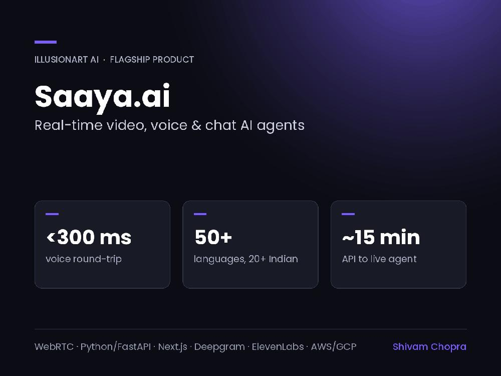
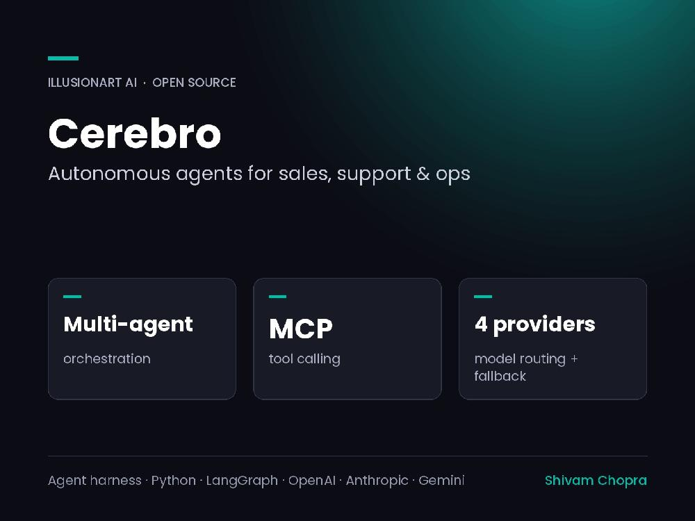
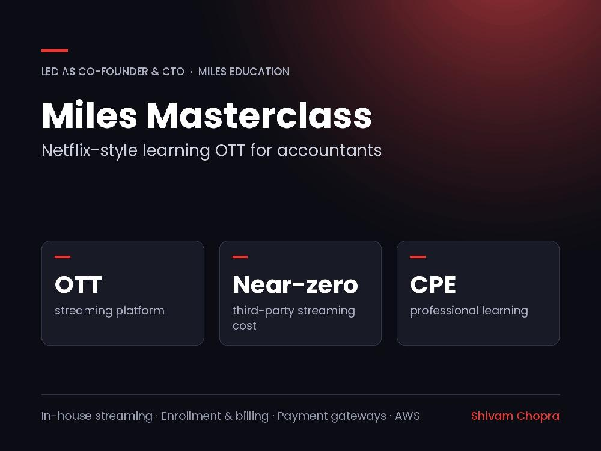
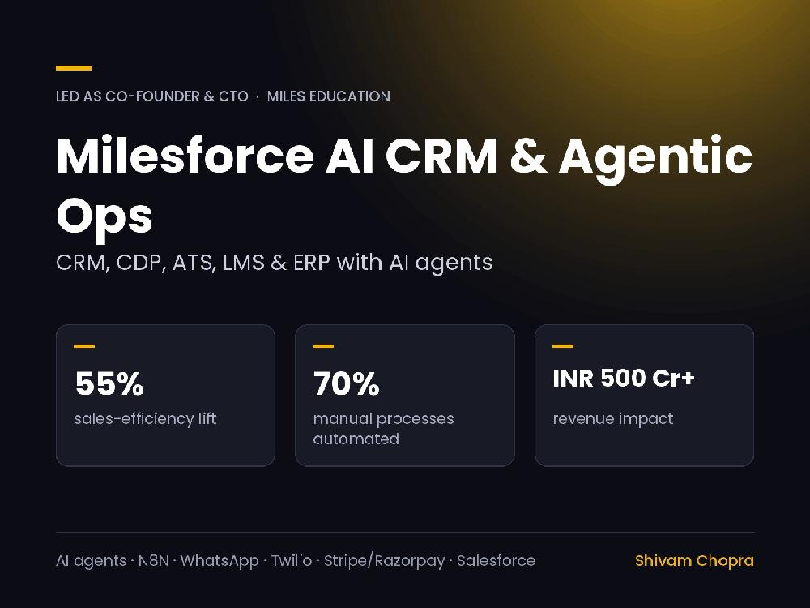
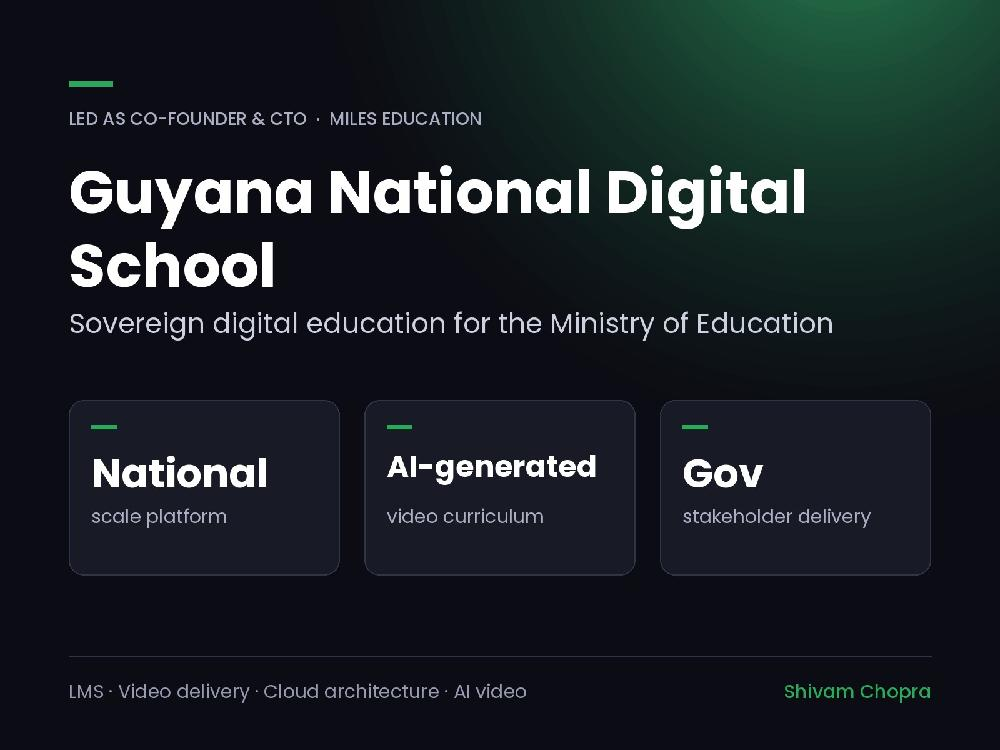
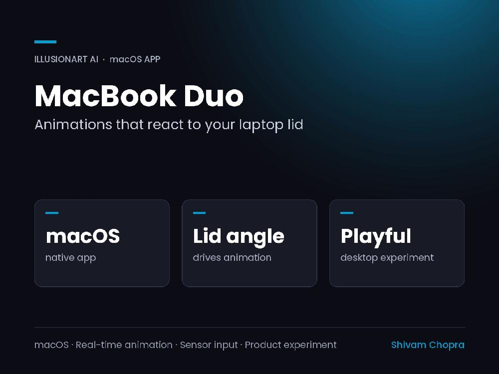
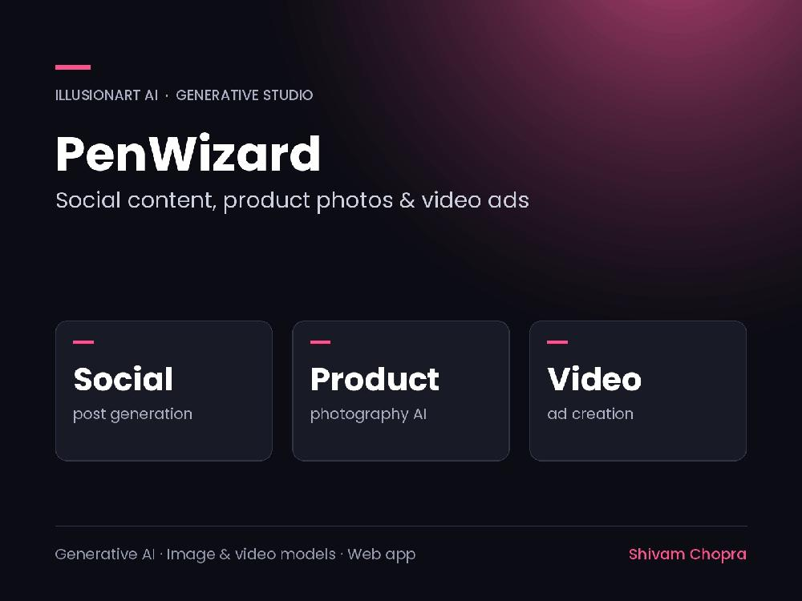
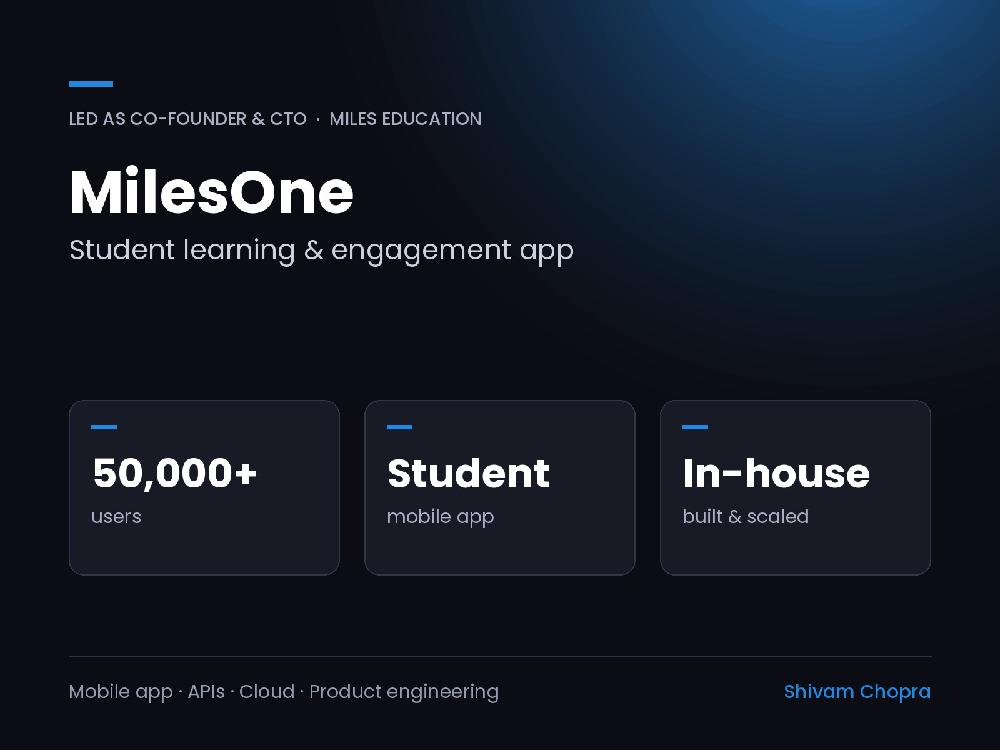
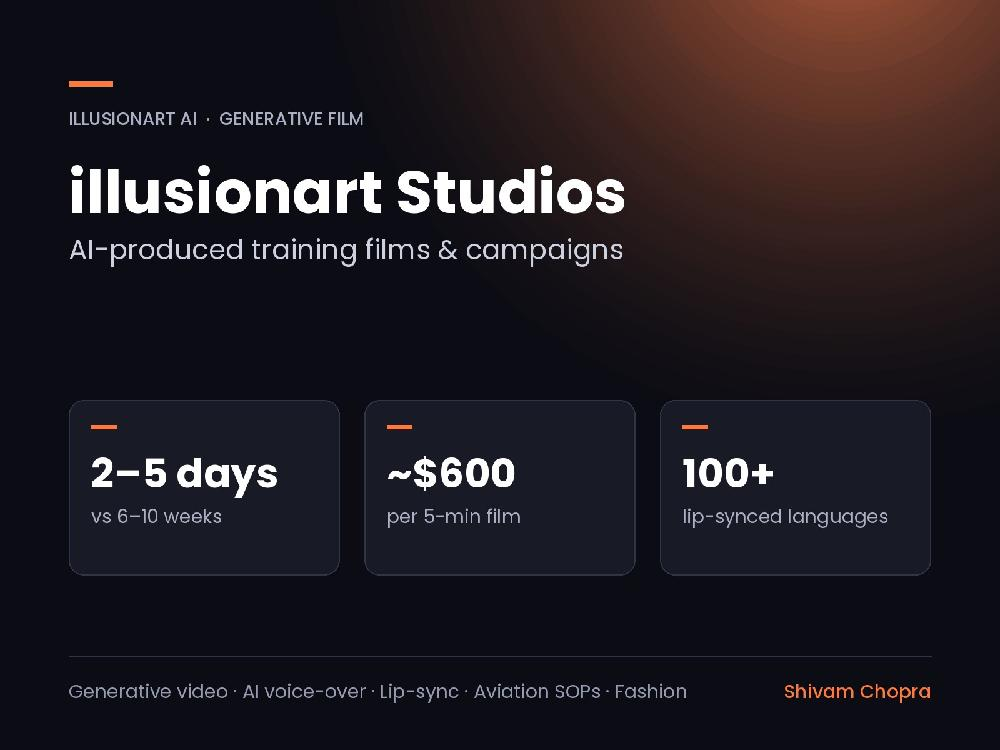

<!-- GitHub profile README for shivamchopra7 -->

<div align="center">
  <a href="https://shivamchopra.me" target="_blank" rel="noopener noreferrer">
    
  </a>
</div>

<div align="center">
  <a href="https://git.io/typing-svg" target="_blank" rel="noopener noreferrer">
    
  </a>

  <br/>

  <a href="https://www.upwork.com/freelancers/shivamchopra" target="_blank" rel="noopener noreferrer"></a>
  <a href="https://shivamchopra.me" target="_blank" rel="noopener noreferrer"></a>
  <a href="https://www.linkedin.com/in/shivamchopra7" target="_blank" rel="noopener noreferrer"></a>
  <a href="https://illusionart.ai" target="_blank" rel="noopener noreferrer"></a>
  <a href="mailto:hello@shivamchopra.me" target="_blank" rel="noopener noreferrer"></a>

</div>

---

## ⚡ About Me

> Back in 2011, I shipped a product with a group of people I had never met in person. Strangers on the internet, fueled by caffeine and pure obsession. Somehow it went viral, and our project — **OSx86 / Hackintosh** — grew into the biggest Hackintosh community on the planet.
>
> 15 years later: same energy, same caffeine, bigger frontiers.
>
> I am a **Chief Technology Officer who still writes and ships code**. I've built and scaled engineering teams from 12 to 110+ engineers, engineered sovereign national education ecosystems for governments, architected real-time voice and video AI platforms solo from research to production, and built product suites that generated **₹500 Cr+ (~$50M+)** in cumulative enterprise revenue across India, the US, and the Caribbean.

---

## `> WHO_AM_I.py`

```python
class ShivamChopra:
    title          = "CTO Who Still Ships Code"
    current_roles  = [
        "Co-Founder & Chief Technology Officer @ Miles Education",
        "Founder & Chief Executive Officer @ illusionart AI"
    ]
    experience     = "14+ Years (12+ in High-Scale Executive Engineering)"
    revenue_impact = "₹500 Cr+ (~$50M+) Cumulative Enterprise Revenue Generated"
    scale_record   = "Shipped 18+ Products | Scaled Engineering Org from 12 to 110+ Engineers"
    specialization = [
        "Agentic AI & Evaluation Harnesses (Tool Calling, MCP, RAG, Evals)",
        "Real-Time Voice & Multimodal AI (<300ms WebRTC, 50+ Languages)",
        "Enterprise Cloud Scale (AWS, GCP, Kubernetes, Kafka, Postgres)",
        "High-Transaction Fintech Billing & Sovereign National EdTech Platforms"
    ]
    open_source    = "Founding Member, OSx86 / Hackintosh Project (Age 20)"
    honors         = ["Salesforce Future First AI Visionary", "Edvocate Leadership Award"]
```

<br/>

<div align="center">
<table>
<tr>
<td align="center" width="25%">
<h3>🚀 18+</h3>
<sub>Enterprise Products Shipped</sub>
</td>
<td align="center" width="25%">
<h3>💰 ₹500 Cr+</h3>
<sub>Cumulative Revenue Impact</sub>
</td>
<td align="center" width="25%">
<h3>👥 110+</h3>
<sub>Engineers Scaled & Led</sub>
</td>
<td align="center" width="25%">
<h3>⚡ &lt;300 ms</h3>
<sub>Real-Time Voice AI Latency</sub>
</td>
</tr>
<tr>
<td align="center">
<h3>🎓 50,000+</h3>
<sub>Active Users on MilesOne</sub>
</td>
<td align="center">
<h3>📈 55% Lift</h3>
<sub>Sales Efficiency via AI Agents</sub>
</td>
<td align="center">
<h3>🇬🇾 Sovereign</h3>
<sub>Digital School Delivered for Gov</sub>
</td>
<td align="center">
<h3>🏆 Visionary</h3>
<sub>Salesforce Future First Award</sub>
</td>
</tr>
</table>
</div>

---

## 💼 Featured Project Showcase

A curated showcase of flagship platforms and products architected, built, and shipped across enterprise AI, real-time media, streaming, and sovereign cloud systems.

<br/>

<table>
<tr>
<td width="50%" valign="top">

<a href="https://saaya.ai" target="_blank" rel="noopener noreferrer">
  
</a>

### 🎙️ [Saaya.ai](https://saaya.ai) &nbsp; `Flagship AI Platform`
> **Role:** Founder & Sole Engineer, illusionart AI

Real-time conversational AI platform with voice, video, chat, and photoreal lip-synced avatars — engineered for automated video KYC, onboarding, customer support, and interactive AI tutoring.

- **Ultra-Low Latency:** Under 300 ms voice round-trip over native WebRTC.
- **Multilingual Support:** 50+ languages, including 20+ Indian languages and Hinglish.
- **Multimodal Intelligence:** Real-time computer vision, sentiment analysis, and liveness detection.
- **Rapid Provisioning:** ~15 minutes from API key to a fully deployed live agent.
- **Architecture:** Built solo from research to production on Kubernetes across AWS and GCP, with dynamic multi-model routing and fallbacks across OpenAI, Anthropic, Gemini, and ElevenLabs.

<br/>

<div>
  
  
  
  
  
  
</div>

<br/>

<a href="https://saaya.ai" target="_blank" rel="noopener noreferrer"></a>

</td>

<td width="50%" valign="top">

<a href="https://github.com/shivamchopra7" target="_blank" rel="noopener noreferrer">
  
</a>

### 🧠 [Cerebro AI](https://github.com/shivamchopra7) &nbsp; `Autonomous Multi-Agent Framework`
> **Role:** Founder & Architect, illusionart AI

An open-source multi-agent framework where autonomous business agents plan, call tools, and hand off tasks to execute end-to-end sales, customer support, and operational workflows.

- **Agent Harness:** Orchestration loops, structured outputs, function calling, and Model Context Protocol (MCP) integrations.
- **Coordination & Memory:** Multi-agent collaboration with persistent session memory and token-budget context pruning.
- **Safety & Guardrails:** Automated validation gates, output sanitization, and evaluation loops.
- **Resilient Routing:** Multi-model routing with fallback cascades across OpenAI, Anthropic Claude, and Google Gemini.
- **Operational Impact:** Automates complex repetitive human workflows into self-healing background jobs.

<br/>

<div>
  
  
  
  
  
  
</div>

<br/>

<a href="https://github.com/shivamchopra7" target="_blank" rel="noopener noreferrer"></a>

</td>
</tr>

<tr>
<td width="50%" valign="top">

<a href="https://milesmasterclass.com" target="_blank" rel="noopener noreferrer">
  
</a>

### 🎬 [Miles Masterclass](https://milesmasterclass.com) &nbsp; `Learning OTT Platform`
> **Role:** Co-Founder & CTO, Miles Education

A Netflix-style streaming platform for professional education and CPE accreditation, serving thousands of finance and accounting professionals globally.

- **Custom Video Engine:** Proprietary in-house streaming architecture reducing 3rd-party video hosting costs to near-zero.
- **High-Transaction Architecture:** Engineered for massive concurrent streaming workloads with adaptive bitrate delivery.
- **Fintech Integration:** Automated multi-currency enrollment, billing cycles, and automated payment gateways.
- **Enterprise Delivery:** End-to-end ownership of architecture, DevOps pipelines, and continuous reliability.

<br/>

<div>
  
  
  
  
  
</div>

<br/>

<a href="https://milesmasterclass.com" target="_blank" rel="noopener noreferrer"></a>

</td>

<td width="50%" valign="top">

<a href="https://mileseducation.com" target="_blank" rel="noopener noreferrer">
  
</a>

### ⚡ [Milesforce CRM & Automation](https://mileseducation.com) &nbsp; `Enterprise AI Stack`
> **Role:** Co-Founder & CTO, Miles Education

Comprehensive proprietary AI-driven business suite powering a multi-country EdTech enterprise: custom CRM, Customer Data Platform (Miles Engage), ATS, LMS, and ERP.

- **55% Higher Sales Efficiency:** Achieved through autonomous AI agents handling real-time demo scheduling, instant lead qualification, and dynamic follow-ups.
- **70% Manual Work Automated:** Elimination of repetitive administrative tasks across admissions, finance, HR, and learner support.
- **Deep Integrations:** Unified workflows across WhatsApp Business API, Twilio, Stripe, Razorpay, Salesforce, and n8n.
- **Scale & Impact:** Backbone platform powering **₹500 Cr+ (~$50M+)** in cumulative business volume.

<br/>

<div>
  
  
  
  
  
</div>

<br/>

<a href="https://mileseducation.com" target="_blank" rel="noopener noreferrer"></a>

</td>
</tr>

<tr>
<td width="50%" valign="top">

<a href="https://digitalschool.moe.edu.gy" target="_blank" rel="noopener noreferrer">
  
</a>

### 🇬🇾 [Guyana Digital School](https://digitalschool.moe.edu.gy) &nbsp; `Sovereign National EdTech`
> **Role:** Co-Founder & CTO (Technology Lead)

A sovereign national digital education ecosystem engineered in partnership with Guyana's Ministry of Education, featuring an AI-generated video curriculum at country-wide scale.

- **National Infrastructure:** Sovereign cloud learning management and video streaming ecosystem serving schools across the nation.
- **AI-Generated Curriculum:** Hundreds of standardized curriculum-aligned video lessons produced with generative AI video pipelines.
- **High-Stakes Delivery:** Designed in direct collaboration with government stakeholders with strict security, availability, and low-bandwidth optimization.
- **Public Deployment:** Live and operational at `digitalschool.moe.edu.gy`.

<br/>

<div>
  
  
  
  
</div>

<br/>

<a href="https://digitalschool.moe.edu.gy" target="_blank" rel="noopener noreferrer"></a>

</td>

<td width="50%" valign="top">

<a href="https://macbookduo.illusionart.ai" target="_blank" rel="noopener noreferrer">
  
</a>

### 💻 [MacBook Duo](https://macbookduo.illusionart.ai) &nbsp; `Hardware-Aware macOS App`
> **Role:** Founder & CEO, illusionart AI

A whimsical native macOS desktop application that reads laptop lid angle sensors in real time and drives physics-based animations that mirror your physical lid movements.

- **Hardware Sensor Integration:** Direct access to MacBook lid angle and motion sensor telemetry.
- **Real-Time Physics:** Silky smooth 60/120 FPS animation loops reacting directly to physical adjustments.
- **Craft & Delight:** Built to stay connected to micro-interactions, hardware-software bridges, and unexpected UX delight.
- **Shipped Product:** Packaged, notarized, and distributed publicly as a desktop experiment.

<br/>

<div>
  
  
  
  
</div>

<br/>

<a href="https://macbookduo.illusionart.ai" target="_blank" rel="noopener noreferrer"></a>

</td>
</tr>

<tr>
<td width="50%" valign="top">

<a href="https://penwizard.ai" target="_blank" rel="noopener noreferrer">
  
</a>

### 🎨 [PenWizard](https://penwizard.ai) &nbsp; `Generative AI Creative Studio`
> **Role:** Founder & CEO, illusionart AI

A self-serve generative AI studio enabling brands, growth marketers, and creators to generate high-performing visual campaigns in minutes.

- **Content Suite:** Automated social media post generation, smart copywriting, and localized caption creation.
- **AI Product Photography:** Dynamic scene synthesis and commercial product render replacements without photoshoots.
- **Short-Form Video Ads:** Multi-modal prompt-to-video ad synthesis optimized for Reels, TikTok, and YouTube Shorts.
- **Multi-Model Pipeline:** Orchestrated on top of state-of-the-art vision, video, and language models with asynchronous generation queues.

<br/>

<div>
  
  
  
  
  
</div>

<br/>

<a href="https://penwizard.ai" target="_blank" rel="noopener noreferrer"></a>

</td>

<td width="50%" valign="top">

<a href="https://mileseducation.com" target="_blank" rel="noopener noreferrer">
  
</a>

### 📱 [MilesOne](https://mileseducation.com) &nbsp; `Student Super App (50k+ Users)`
> **Role:** Co-Founder & CTO, Miles Education

The central mobile app ecosystem powering the daily educational journey of 50,000+ enrolled students and working professionals.

- **High-Concurrency Scale:** Built to handle live classes, session attendance, community chats, and real-time push alerts.
- **End-to-End Integration:** Seamless bi-directional sync with Milesforce CRM, the examination engine, and LMS repositories.
- **High-Security Standards:** Enterprise data protection, secure authentication, and encrypted document storage.
- **Product Strategy:** Steered from initial roadmap and UX prototypes to 50,000+ active learners across India and the US.

<br/>

<div>
  
  
  
  
</div>

<br/>

<a href="https://mileseducation.com" target="_blank" rel="noopener noreferrer"></a>

</td>
</tr>

<tr>
<td colspan="2" valign="top">

<a href="https://illusionart.ai" target="_blank" rel="noopener noreferrer">
  
</a>

### 🎥 [illusionart Studios](https://illusionart.ai) &nbsp; `Generative AI Film & Training Production`
> **Role:** Founder & CEO, illusionart AI

An AI-driven film studio producing custom enterprise training videos, compliance SOP films, and high-impact commercial campaigns in days instead of months.

- **10x Speed:** Delivers broadcast-ready training films in **2–5 days** instead of traditional 6–10 week production cycles.
- **90%+ Cost Reduction:** Cuts production costs to ~$600 per 5-minute video compared to $10,000+ for traditional shoots.
- **Global Localization:** Automated voice-over and photorealistic lip-sync across **100+ languages**.
- **Real-World Impact:** Deployed across airline aviation SOPs, luxury fashion campaigns, and corporate training repositories.
- **Film Craft + AI Pipeline:** Blends generative video and synthetic voice models with Hollywood-grade editorial direction rooted in my early film editing career.

<br/>

<div align="center">
  
  
  
  
  
</div>

<br/>

<div align="center">
  <a href="https://illusionart.ai" target="_blank" rel="noopener noreferrer"></a>
</div>

</td>
</tr>
</table>

---

## 🏛️ Additional Product Ecosystem & Inventions

Beyond the primary showcase, platforms and ecosystems designed and operated under my architectural leadership:

*   **<a href="https://cpa.mileseducation.com" target="_blank">Miles CPA & CMA LMS</a>:** High-fidelity simulation LMS platforms mimicking real AICPA & IMA proctored examination environments.
*   **<a href="https://mojocampus.com" target="_blank">Mojo Campus</a> & <a href="https://matrixcampus.in" target="_blank">Matrix Campus</a>:** Campus relationship management and unified student lifecycle operations.
*   **<a href="https://eeshani.in" target="_blank">Eeshani</a>:** Custom luxury brand e-commerce architecture with bespoke headless checkout.
*   **Pixelfluent.ai & Codecraft:** Rapid prototyping environments translating natural language and sketches into playable interactive applications.
*   **vibenmeet.com:** Voice-call matchmaking platform featuring instant real-time audio rooms.
*   **Retro iPod Web App:** A nostalgic, interactive web recreation of the classic click-wheel iPod with haptic feedback and real audio playback.
*   **OSx86 Project (Hackintosh):** Founding contributor at age 20 for the global open-source project porting macOS to standard x86 PCs.

---

## 🛠️ Technical Competency & Tooling

<div align="center">

### AI Agents, Multimodal & LLM Infrastructure


### Cloud, Scale & DevOps


### Backend & High-Concurrency Systems


### Frontend, Mobile & Automation


</div>

---

## 🏆 Honors & Recognition

*   🏆 **Salesforce Future First AI Visionary (2025):** Recognized by Salesforce Inc. for groundbreaking enterprise AI and agentic workflow innovation.
*   🎖️ **Edvocate Leadership Award (2022):** Awarded for transformational leadership in cloud learning technology.
*   💡 **Innovative Thinker Award:** Conferred by Miles Education for architectural breakthroughs contributing ₹500 Cr+ in enterprise value.
*   🍏 **Founding Member, OSx86 (Hackintosh) Project:** Core founding member at age 20 of one of the world's most widespread open-source OS porting initiatives.
*   ✈️ **Aviation L&D Excellence:** Architected learning & development training ecosystems for commercial aviation.
*   🤖 **Robotics & National Curriculum:** Co-architect of sovereign digital curriculums and robotics education programs.

---

## 🤝 Why Clients & Partners Work With Me

I was the CTO, and I still write the code. You get architecture that holds up under real production traffic, plus a build that ships immediately — instead of pitch decks and juniors learning on your budget.

*   **Architecture First, Weekly Working Releases:** No endless discovery meetings. You get an architecture diagram and clickable software from week one.
*   **Clear Written Progress, Zero Theatre:** Asynchronous, transparent, and direct communication.
*   **Security & Data Compliance by Default:** DevSecOps, GDPR, and India DPDP compliance embedded into every architecture.
*   **100% IP Ownership:** You own every single line of code, documentation, and model prompt from day one.

---

## 📬 Let's Build Something Meaningful

Whether you are looking to build a **real-time voice/video AI agent**, deploy an **autonomous workflow that touches real databases**, launch an **MVP properly on the first pass**, or bring on a **fractional CTO** to set architecture and unblock your team:

<br/>

<div align="center">

<a href="https://www.upwork.com/freelancers/shivamchopra" target="_blank" rel="noopener noreferrer"></a>
&nbsp;
<a href="https://shivamchopra.me" target="_blank" rel="noopener noreferrer"></a>
&nbsp;
<a href="https://www.linkedin.com/in/shivamchopra7" target="_blank" rel="noopener noreferrer"></a>
&nbsp;
<a href="mailto:hello@shivamchopra.me" target="_blank" rel="noopener noreferrer"></a>

</div>

<br/>

---

<div align="center">
  
</div>
